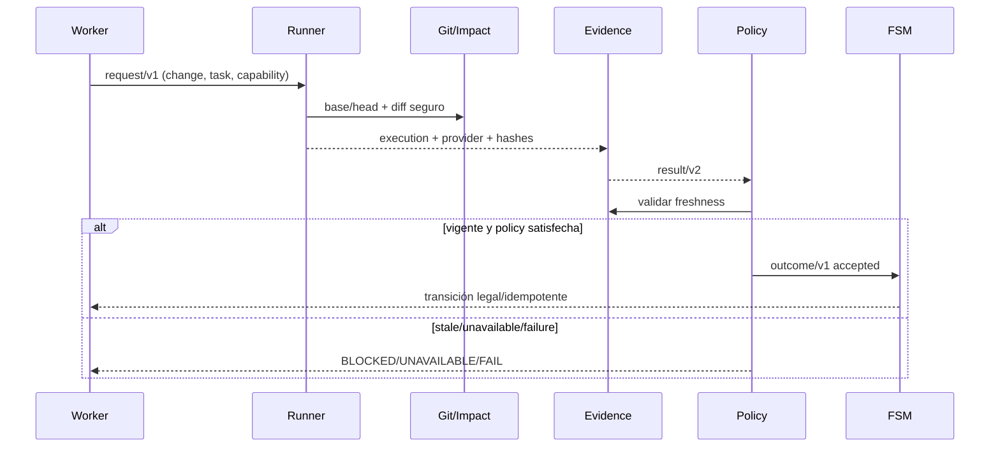
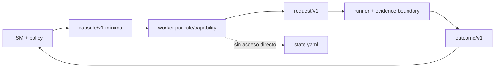

# Design: Capability-Driven Agent Control Plane

## Technical Approach

Segunda capa sobre los contratos actuales: `sdd-quality-runner.mjs` ejecuta y `sdd-fsm.mjs` gobierna fases. Helpers de `scripts/sdd-runner-lib/` añaden identidad Git, impact set, policy, toolchain y métricas; el FSM sólo acepta outcomes con evidencia vigente. No se crea CLI de producto, otra FSM, SQLite, XState, `.opencode/tools` ni hooks no verificados. El cambio anterior permanece `qa/BLOCKED`.

## Architecture Decisions

| Decisión | Elección / alternativas rechazadas | Rationale |
|---|---|---|
| Autoridad | Código valida evidencia, policy y transiciones; agentes solicitan e interpretan. No plugin-first ni clonación six-pack/tmux. | Portable fuera de OpenCode; la prosa no puede fabricar `PASS` o estado. |
| Identidad | `git -C root rev-parse --verify HEAD^{commit}` para head; `base_sha` explícito y validado con `git cat-file -e`; `git diff --name-status -z base head`, normalizado/ordenado, para changed files. `git status --porcelain=v1 -z` registra dirty; sin modo explícito, bloquea. | Sin inferir branch/remoto ni convertir shallow/no-Git en diff vacío: se registra `UNAVAILABLE/BLOCKED`. |
| Versiones | Manifest `quality-runner/v1`; extensiones `control-plane/v1`, `capability-policy/v1`, `toolchain-lock/v1`, envelope `quality-runner-result/v2`. Lectores aceptan v1; sin identidad sólo fallback. Flags `control_plane`, `quality_runner`, `workflow_fsm` off. | Migración gradual sin romper fixtures ni activar enforcement global. |
| Metrics | `metrics/v1` exige provider, versión, semantics, scope, raw/normalized y artefactos. CRAP sólo con inputs adapter-provided del mismo adapter: `CC² × (1-coverage)³ + CC`. Mutation provider-specific/differential; DRY advisory; acceptance opcional. | No mezclar semantics, usar CRAP universal `<=6`, mutation genérica ni DRY como hard fail. |
| Toolchain | `openspec/quality-toolchain.lock` pinnea versión/commit/digest; `latest`, rangos y upgrades implícitos se rechazan en gates. | Reproducibilidad sin resolver red durante la verificación. |
| Roles/capabilities | `specify` para init/explore/propose/spec/design/tasks; `edit_product/tests` para apply/senior-dev; `run_quality` para verify; `run_acceptance` para QA; `review/architecture_review` para especialistas. Kerrigan enruta y solicita, no certifica. Prompts/capsules aportan contexto; código impone hashes, policy y autoridad. | Usa roles reales sin inventar APIs runtime ni exigir agentes permanentes. |

## Modules and Data Flow

| Módulo | Responsabilidad |
|---|---|
| `evidence-boundary.mjs` | Redacción existente más hashes de envelope, config, comandos, artefactos y toolchain. |
| `git-impact.mjs` | Commits/paths seguros, dirty state, archivos y `impact_digest`. |
| `policy.mjs` | `required/preferred/disabled`, profiles `FAST/STANDARD/FULL` y decisión de gate. |
| `toolchain.mjs`, `metrics.mjs` | Validar lock y normalizar adapters; no inferir lenguaje. |
| `stale.mjs` | Comparar SHA, impact/config/policy/lock/artifact digests y HEAD actual. |

## Interfaces / Authority Boundaries

`capsule/v1 {change_id, task_id, run_id, role, capability, phase, objective, impact_set_ref, base_sha, head_sha, evidence_refs, allowed_actions, allowed_outcomes, constraints}`. `request/v1` añade `expected_revision/hash` e idempotency key; `outcome/v1` devuelve `accepted, status, reason, evidence_refs, stale, revision`. Workers no escriben `state.yaml`, evidence, policy ni lock. Una futura `human-waiver/v1` exigirá identidad humana, razón, finding, scope y expiración; ningún agente la emite.

## File Changes

| Archivo | Acción | Descripción |
|---|---|---|
| `scripts/sdd-runner-lib/{git-impact,policy,toolchain,metrics,stale}.mjs` | Crear | Helpers portables de la segunda capa. |
| `scripts/sdd-quality-runner.mjs`, `result.mjs`, `config.mjs` | Modificar | Envelopes/policy/versiones, conservando ejecución/redacción. |
| `scripts/sdd-fsm.mjs`, `state.mjs` | Modificar después | Guardar evidencia vigente, conservando lock/revision. |
| `openspec/quality-runner.schema.json`, `config.yaml` | Modificar después | Extensiones y flags off. |
| `scripts/fixtures/`, `scripts/*smoke.sh` | Crear/modificar | Git, stale, policy, lock y adapters. |
| prompts/documentación | Posterior | Capsules/ownership; `opencode.json` no cambia en Slice 1. |

## Slices, Testing, Rollout

1. **Identity boundary:** envelope/policy/impact/stale; fixtures para Git normal, shallow/no-Git, dirty, stale y `latest` rechazado.
2. **Reproducibilidad:** lock y `metrics/v1`; CRAP con inputs adapter-provided, mutation diferencial, DRY advisory y acceptance unavailable.
3. **Coordination:** capsules, request/outcome y guardas FSM; después handoffs/event log, sin segunda FSM.
4. **Adopción:** prompts/perfiles sólo tras contratos verificables.

No hay root test runner: usar JSON validation, `node --check`, fixtures y `sdd-quality-smoke.sh`/`sdd-fsm-smoke.sh`; no reclamar TDD ni aceptación de producto. Cada slice debe forecast y guard de 400 líneas; si es alto, PR encadenado con rollback autónomo. Rollout: source checkout → submódulo dotfiles → Dotter → `~/.config/opencode` efectivo, smoke en cada etapa. Rollback: apagar flags/policy, retirar artifacts/config derivada y revertir slice; no tocar `state.yaml` ni el cambio anterior.

## Open Questions

- [ ] Cada integración debe declarar la fuente de `base_sha`; sin ella el gate queda unavailable.
- [ ] Fijar semantics/providers de coverage y adapters mutation antes de hacerlos `required`.
- [ ] Diseñar/aprobar la waiver humana en una slice separada.
