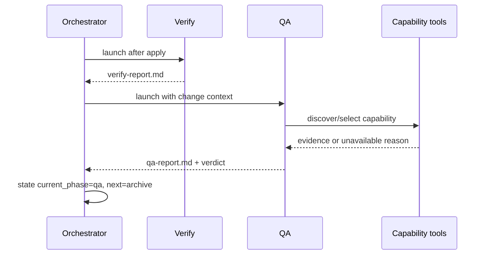
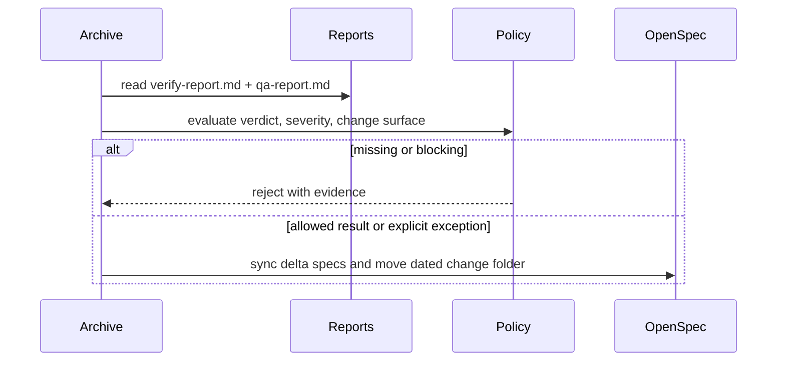

# Design: Integrate Acceptance QA Phase

## Technical Approach

Add a first-class, capability-driven `sdd-qa` executor between technical verification and archive. `sdd-verify` remains responsible for spec/design/task conformance; `sdd-qa` validates observable user/operator behavior and writes `qa-report.md`. The orchestrator remains prompt-driven: `state.yaml`, artifact checks, and `sdd-continue` enforce resumability without a new runtime state machine.

## Architecture Decisions

| Decision | Choice | Alternatives rejected | Rationale |
|---|---|---|---|
| Executor/permissions | Register hidden `sdd-qa` in `opencode.json`; grant Kerrigan `task.sdd-qa`; expose read/bash/write only. Use existing enabled Playwright and Chrome DevTools MCP servers. | Reuse `qa-engineer`; give QA edit/delegate permissions | Dedicated routing is auditable; no code mutation prevents QA from silently fixing its evidence. |
| Prompt composition | Add thin `prompts/sdd/sdd-qa.md` and phase contract `skills/sdd/sdd-qa/SKILL.md`, both using shared protocol and OpenSpec convention. | Put QA in `sdd-verify`; copy browser workflows into SDD | Separates technical and acceptance gates and avoids duplicated, drifting browser guidance. |
| Capability discovery | Inspect target, change surface, and available MCP/skills at runtime; select the narrowest applicable capability and record available, selected, and rejected capabilities. | Require Playwright/browser automation for every change | Environments differ; unavailable runtime capability must be evidence, not fabricated success. |
| Artifact/report | Canonical `openspec/changes/{name}/qa-report.md`, preserved on archive. Verdicts: `PASS`, `PASS WITH WARNINGS`, `FAIL`, `BLOCKED`, `NOT TESTED`; findings use `CRITICAL`, `P0`–`P3`. | Reuse `verify-report.md` or transient output | Separate ownership and evidence types make archive validation independent and auditable. |
| State enforcement | Update `sdd-continue` and orchestrator contracts to route `verify → qa → archive`; require a valid QA report before archive. | Add executable transition code now | This JSON/Markdown repository has no state engine; contract-first enforcement avoids speculative infrastructure. |
| Archive policy | Require both reports; block missing reports, failed verification, QA `FAIL`, and unresolved `CRITICAL`/P0/P1. `BLOCKED`/`NOT TESTED` blocks acceptance-relevant changes; docs/config-only changes may proceed only with explicit rationale and warning. | Always block or always allow unavailable checks | Prevents false confidence without making non-runtime changes unarchivable. |

## Data Flow

```text
apply → verify → verify-report.md → sdd-qa
                                      ├─ inspect artifacts, target, environment
                                      ├─ resolve and run available capabilities
                                      └─ write qa-report.md → state.next=archive
```





## File Changes

| File | Action | Description |
|---|---|---|
| `opencode.json` | Modify | Register executor and Kerrigan permission; preserve MCP enablement. |
| `prompts/sdd/sdd-qa.md`, `skills/sdd/sdd-qa/SKILL.md`, `commands/sdd-qa.md` | Create | Routed prompt, execution/report contract, and command route. |
| `skills/sdd/_shared/openspec-convention.md` | Modify | Add QA artifact and retrieval path. |
| `AGENTS.md`, `README.md`, `commands/sdd-continue.md` | Modify | DAG, state recovery, gates, and phase documentation. |
| `prompts/sdd/sdd-apply.md`, `sdd-verify.md`, `sdd-archive.md` | Modify | Handoff, separation, and two-report gate. |
| `openspec/config.yaml` | Modify | QA verdict, required-surface, exception, and archive policy knobs. |
| `.agents/skill-registry.md` | Modify | Index executor and reusable QA capability references. |

## Interfaces / Contracts

`qa-report.md` SHALL include change/mode, target/environment, capability inventory and selection rationale, scenario matrix (attempted/passed/failed/untested), command output or evidence references, severity findings, explicit `BLOCKED`/`NOT TESTED` reasons, and final verdict. `state.yaml` records `completed: [..., qa]` and `next: archive`; missing/stale state falls back to artifact existence and policy. Suggested knobs: `rules.qa.required_for`, `block_on`, `blocked_policy`, `not_tested_policy`, and `rules.archive.require_reports`/`require_qa`.

## Testing Strategy

| Layer | What to Test | Approach |
|---|---|---|
| Configuration smoke | JSON registration, permissions, relative paths | Parse with `node`; assert unique agent, command/prompt/skill paths, and preserved MCP names. |
| Contract smoke | DAG, report, and policy consistency | Markdown/path checks; YAML parse when available; fixture checks for missing/blocking reports. |
| Browser/E2E | Actual product acceptance | Only with a target URL/app. Reuse Playwright, agent-browser, browser verification, full-story verification, accessibility, web-quality, or manual `qa-session`; otherwise report `NOT TESTED`, never PASS. |

## Migration / Rollout

No data migration. In-flight changes with verification but no QA report resume at `qa`; rollback is a revert of registration/contracts/policy, while reports remain audit artifacts.

## Open Questions

- [ ] Confirm default `required_for` classification and approval requirement for non-runtime exceptions.
- [ ] Confirm P2/P3 warning treatment.
