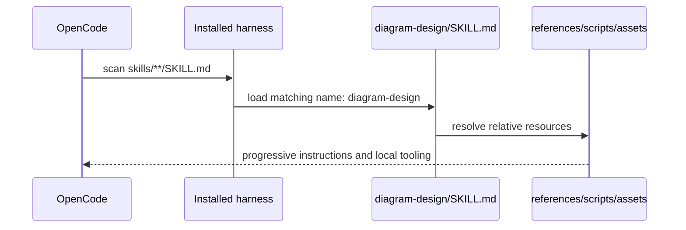
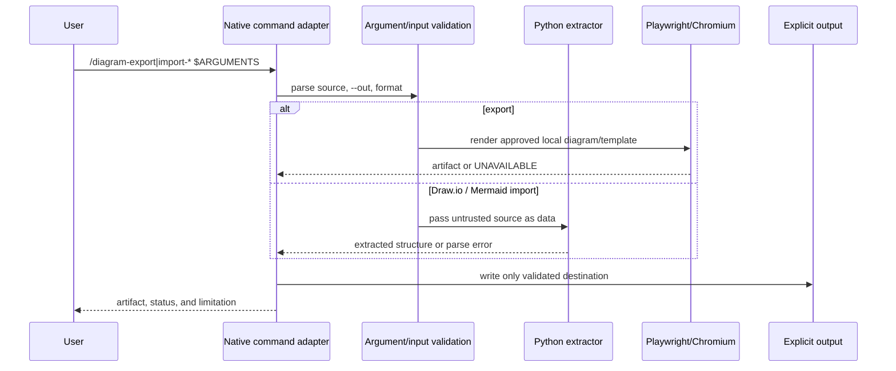

# Design: Integrate Diagram Design Skills

## Technical Approach

Vendor the upstream Agent Skills subtree as a pinned snapshot at commit
`a5e3978088cf89c7caff5c20cabd99fbc2a301de` (version `2.3.5`) under
`skills/design/diagram-design/`. Preserve `SKILL.md`, every relative `references/`, `scripts/`, and
`assets/` entry; add three thin OpenCode-native Markdown command adapters and local provenance/license
metadata. This implements the proposal's two capabilities without changing production code, plugins,
MCP, permissions, or runtime dependencies.

## Architecture Decisions

| Concern | Options / trade-off | Decision and rationale |
|---|---|---|
| Distribution | Vendor; unverified plugin; subtree; runtime fetch | Vendor the complete snapshot: offline, reproducible, and aligned with discovery. Plugin loading is unverified; subtree/runtime fetch adds distribution or network failure modes. |
| Layout / discovery | Flatten; new root; ecosystem nesting | Use `skills/design/diagram-design/SKILL.md` with matching lowercase-hyphen frontmatter. OpenCode scans `skills/**/SKILL.md`; commands stay in root `commands/`. |
| Relative integrity | Rewrite links; copy prompt only; preserve tree | Copy the whole tree without renaming or rewriting links. Run path checks and upstream `self_check.py`; keep metadata beside the snapshot. |
| Command arguments | Implicit defaults; shell strings; explicit contract | Standalone commands consume `$ARGUMENTS`: required local source, optional `--out`, and supported export format. Reject invalid arguments, pass quoted paths, and never shell-evaluate. |
| Optional capabilities | Auto-install; hard dependency; capability probe | Probe `python3` and Playwright/Chromium. Report `AVAILABLE`, `UNAVAILABLE`, `BLOCKED`, or `ERROR`; never install or fetch implicitly. |
| Untrusted inputs | Execute embedded content; remote rendering; parse as data | Treat Draw.io XML and Mermaid as data. Use pinned extractors, validate local paths/size, never evaluate embedded/generated code, and require explicit output. |
| Docs / registry | Add generator; leave stale; synchronized maintenance | Update `README.md`, `AGENTS.md`, and `.agents/skill-registry.md` together from the filesystem. Add no generator; filesystem remains authoritative and counts descriptive. |
| Rollout / rollback | Feature flag; config/plugin rollout; additive snapshot | Deploy to the effective skills/commands path and verify both locations. Revert snapshot, adapters, metadata, and docs; preserve `openpencil-skill`. |

## Data Flow





## File Changes

| File | Action | Description |
|---|---|---|
| `skills/design/diagram-design/{SKILL.md,references/**,scripts/**,assets/**}` | Create | Complete pinned snapshot; no resource pruning. |
| `skills/design/diagram-design/{PROVENANCE.md,LICENSE,THIRD-PARTY-NOTICES.md}` | Create | Commit/version identity, refresh boundary, MIT text, and icon/source attribution. |
| `commands/diagram-export.md` | Create | Native export adapter with Playwright/Chromium capability reporting. |
| `commands/diagram-import-drawio.md` | Create | Native adapter invoking the pinned Draw.io extractor safely. |
| `commands/diagram-import-mermaid.md` | Create | Native adapter invoking the pinned Mermaid extractor safely. |
| `README.md`, `AGENTS.md`, `.agents/skill-registry.md` | Modify | Discovery, routing, provenance, workflows, and smoke checks. |
| `opencode.json` | No change | Do not add an upstream plugin or alter existing integrations. |

## Interfaces / Contracts

```text
/diagram-export <source> [--format <upstream-supported-format>] [--out <path>]
/diagram-import-drawio <source> [--out <path>]
/diagram-import-mermaid <source> [--out <path>]

SnapshotProvenance = {
  upstream_commit: "a5e3978088cf89c7caff5c20cabd99fbc2a301de",
  upstream_version: "2.3.5",
  subtree: "skills/diagram-design",
  local_path: "skills/design/diagram-design"
}
```

## Testing Strategy

| Layer | What to Test | Approach |
|---|---|---|
| Unit | N/A | No repository test runner; no TDD claim. |
| Integration | Frontmatter, discovery path, relative links, preserved tree, docs, unchanged `opencode.json` | Deterministic filesystem/frontmatter checks plus `self_check.py` when Python is available. |
| Smoke | Three command contracts and optional tools | Run fixtures/import scripts; export only when Playwright and Chromium exist. Record unavailable tooling; this is not product acceptance. |

## Migration / Rollout

No data migration or feature flag. Delivery uses the proposal's review slices: snapshot/integrity,
adapters, then docs/smoke evidence. The high 400-line risk remains a tasks/apply concern; each slice
needs its own verification and revert boundary.

## Open Questions

- [ ] During implementation, confirm the canonical upstream repository URL in `PROVENANCE.md`; the
  commit and version are fixed and non-negotiable.
