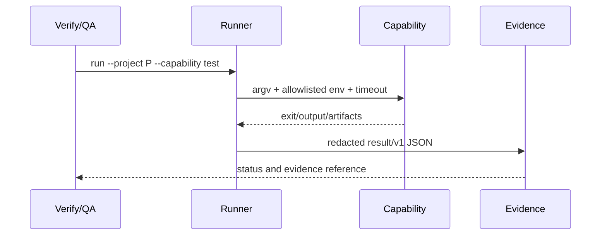
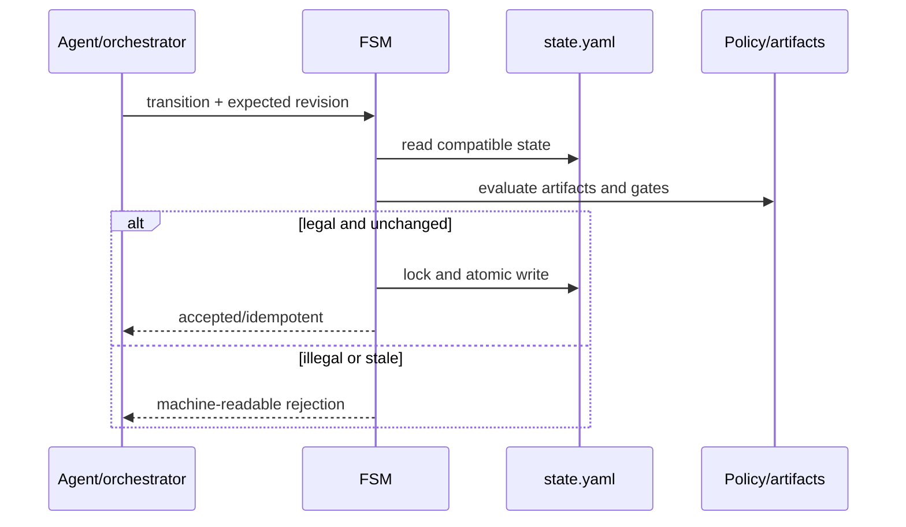

# Design: Deterministic Quality Runners and SDD FSM

## Technical Approach

Add an opt-in Node.js runner using built-ins only under `scripts/`, plus an executable OpenSpec FSM. Projects provide capabilities; the runner normalizes evidence and the FSM accepts transitions. OpenCode remains an adapter: no invented hook or `opencode.json` change.

## Architecture Decisions

| Decision | Choice | Rejected | Rationale |
|---|---|---|---|
| Config | `openspec/quality-runner.json`, schema `quality-runner/v1`; `--config` overrides it. `openspec/config.yaml` remains policy authority. | Stack inference, hidden defaults | Explicit and portable; absent/unsupported configuration cannot become a false pass. |
| Execution | `argv` by default; `shell: {enabled: true, reason: ...}` is mandatory opt-in. | Always using a shell | Safer quoting and auditable, testable command identity. |
| Authority | `sdd-quality-runner.mjs` emits results; `sdd-fsm.mjs` accepts transitions; agents explain evidence. | Model prose or plugin authority | Testable outside OpenCode; rollback and fallback stay simple. |
| State | Preserve `change`, `current_phase`, `completed`, `next`, `updated`; add revision metadata only on new writes. | Eager migration | Existing active and archived states stay readable. |

## Modules / File Changes

| File | Action | Responsibility |
|---|---|---|
| `scripts/sdd-quality-runner.mjs` | Create | Resolve project/config, execute capabilities, emit JSON. |
| `scripts/sdd-fsm.mjs` | Create | Parse state, evaluate gates, lock, transition, atomically write. |
| `scripts/sdd-runner-lib/{config,exec,result,redact,state,atomic}.mjs` | Create | Contract, process, normalization, redaction, YAML, persistence. |
| `openspec/quality-runner.schema.json`; `openspec/config.yaml` | Create/modify | Versioned manifest and existing policy vocabulary. |
| `prompts/sdd/sdd-verify.md`, `sdd-qa.md`, shared convention, `README.md` | Modify | Consume evidence, label fallback, document distribution. |
| `scripts/fixtures/`; `scripts/sdd-smoke.sh` | Create | Contract, FSM, concurrency, and distribution fixtures. |

## Interfaces / Contracts

Capabilities declare `id`, `argv`/explicit shell, `cwd`, `timeout_ms`, `env_allowlist`, `artifacts`, `parser`, `exit_codes`, `required`, and `blocking`. Each run writes `artifacts/runs/{run-id}/{capability}.json` with schema/config digests, resolved argv/cwd, `status`, exit/signal, termination, duration, parser result, redacted output references, artifact paths, and environment fingerprint.

`PASS` requires accepted exit, parser, and thresholds. Non-zero or parser rejection is `FAIL`; timeout or external prevention is `BLOCKED`; missing executable/config is `UNAVAILABLE`; intentional skip is `NOT_TESTED`. QA maps unavailable to `NOT TESTED`, external prevention to `BLOCKED`, and execution failure to `FAIL`.

The runner MUST pass only allowlisted environment keys, reject paths outside the project root, cap output/artifact size, redact configured names/regexes, and kill the process group on timeout. Raw secrets are never persisted; relative artifact paths are recorded even when absent. JSON and human evidence are written for every attempted capability, including unavailable, blocked, and not-tested outcomes.

## FSM, Gates, and Persistence

| From → To | Gate |
|---|---|
| `init→explore→propose` | Required preceding artifact. |
| `propose→spec` or `propose→design` | Proposal exists; branches may run in parallel. |
| `spec + design→tasks` | Both artifacts/specs exist. |
| `tasks→apply→verify` | Tasks and apply handoff exist. |
| `verify→qa` | `verify-report.md` exists and is not `FAIL`. |
| `qa→archive` | Existing archive policy rejects missing reports, `FAIL`, unresolved CRITICAL/P0/P1, and acceptance-relevant `BLOCKED`/`NOT TESTED`. |
| `verify|qa→apply` | Explicit remediation; `archive` is terminal. |

Legacy `next: spec-design` means two branches; missing fields derive from artifacts and unknown keys are preserved. Transitions require expected revision/hash plus idempotency key: same input is a no-op, changed state is `BLOCKED`. Acquire `${change}/.fsm.lock` with atomic `mkdir` and PID/host/time; stale locks require liveness/TTL evidence or explicit force. Write temp state, fsync, then rename. Do not change this phase’s existing `state.yaml`.

Determinism covers normalized config/state/artifact digests and interpretation. Commands, network/MCP, credentials, clocks, filesystem order, and model output vary; fingerprints expose it.

## Data Flow / Sequences

Verify/QA retain JSON references and reasons in existing Markdown reports; prose cannot override runner status. Disabled/unavailable runner uses the current prompt flow, marked `fallback` and never treated as deterministic enforcement.

## Testing, Rollout, and Rollback

With no root test runner, `sdd-smoke.sh` performs Node syntax/contract checks and fixtures for two stacks, status paths, timeout/redaction, legacy state, illegal archive, idempotency, stale locks, and concurrent writers. This is not TDD or product acceptance. Smoke runs from the harness, submodule, and Dotter-materialized `~/.config/opencode`; resolution never embeds a source path. Rollout is commit → submodule → Dotter → smoke. Rollback disables the manifest/FSM and reverts adapters/scripts, preserving reports/state.

## Open Questions

- [ ] Decide whether v1 needs a separate JSON policy projection for consumers whose YAML uses unsupported constructs.
